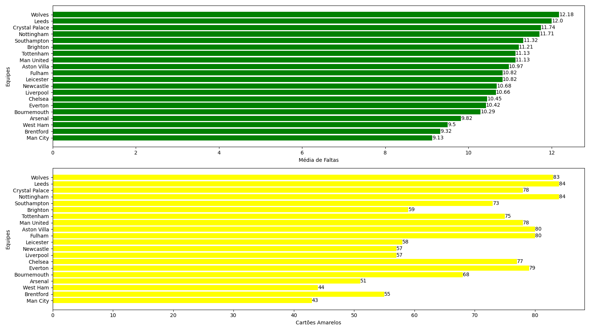

# Análise entre média de faltas cometidas por jogo e número de cartões recebidos na temporada

A análise consiste em determinar o seguinte gráfico:

Deste gráfico podemos inferir que:
- Nos extremos, a ideia de que uma maior média de faltas por jogo acarreta maior número de cartões ao longo da temporada é verdadeira
- Algumas equipes não seguem esta correspondência
- Falta levar em consideração a gravidade das faltas e o número de cartões vermelhos na temporada (com peso adequado)
- O Manchester City (campeão da PL 2022-23) teve a menor média de faltas e menor número de cartões no campeonato
- Das equipes rebaixadas, Leeds e Southampton possuem uma alta média de faltas e número de cartões amarelos e o Leicester possui uma média de faltas razoável junto a um total de cartões baixo (em relação a média)